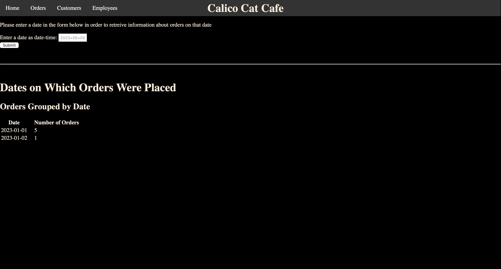

# restaurant-admin-web-app
This is a web application written using HTML, CSS, SQL, and PHP for a semester project in my databases class. 

The application is meant to be used by the restaurant owner/manager to access and manage the database. 
There are four pages to the application:

Page 1:

Page 2:

Page 3:

Page 4:

